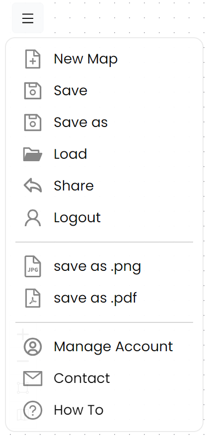
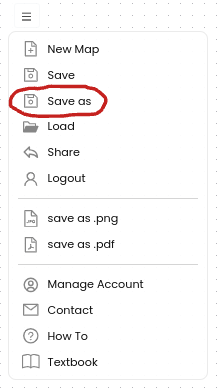

With an Argumentation.io Subscription, you can save, share, and download your maps. To use these functions, ensure that you're logged in with an account with a subscription. If you're logged in, you'll see your subscription email address in the upper right-hand corner, next to the Scratchpad icon.

# Saving
1. Click the Main Menu button (the button in the upper left-hand corner with the three horizontal lines on it). 
2. Select Save as or Save.
   
4. Choose a name for your map.
5. Click Save.

# Sharing
Once you've saved a map, you can share it through a URL or web link. To do so, click Share, then copy the link.

# Downloading
You can download your map to your device as either a PNG (a kind of image file) or PDF (a kind of document file). Both options are in the Main Menu. When you click Save as png or Save as pdf, you'll get the opportunity to name the file and choose where you want to save it.
