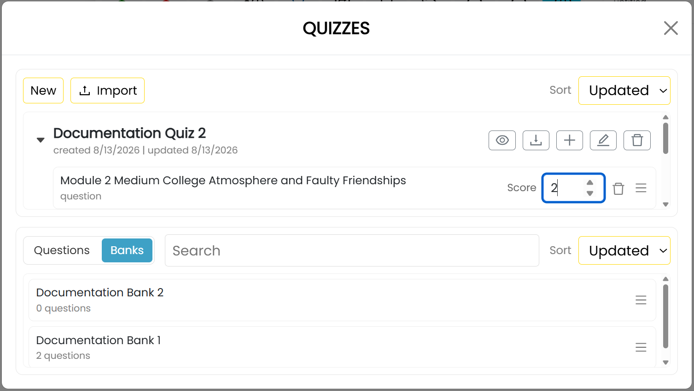

# Create Quizzes

A quiz groups questions for use in an assignment. It can contain individual questions, selections drawn from question banks, or both.

## Create a quiz

1. Open **Main Menu** and select **Quizzes**.
2. Select **New**.
3. Enter a name for the quiz and confirm.

The upper area of the **Quizzes** window contains your quizzes. The lower area has **Questions** and **Banks** tabs for the items you can add.

## Add questions or banks

Drag a question or bank from the lower area onto the desired quiz. You can also select the add command beside a quiz, choose the **Questions** or **Banks** tab in the **Add Items** window, select the items, and then select **Add**.

For a question bank, set **Pick** to the number of questions the quiz should draw from that bank.

## Assign scores

Set the **Score** value beside each question or bank item to specify its contribution to the quiz score.

## Preview, export, or import a quiz

- Select the eye-shaped preview command beside a quiz to preview it.
- Select the export command beside a quiz to download it as a JSON file.
- Select **Import** at the top of the window and choose an exported quiz file to add it to your quizzes.

A quiz is not available to students until you use it in a published assignment.
