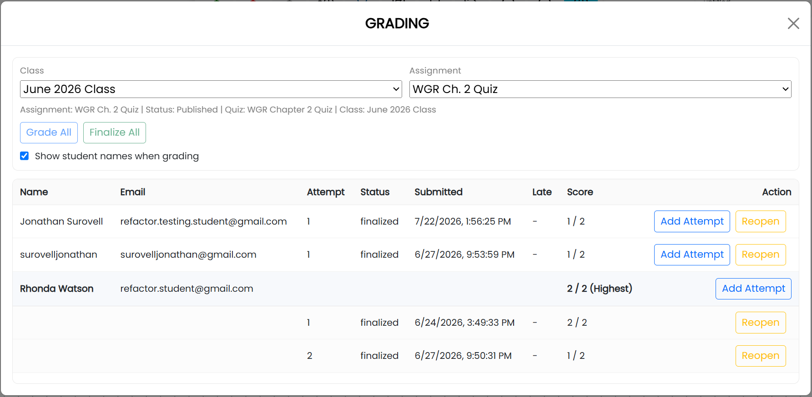

# Grade Assignments and Provide Feedback

## Choose submissions to grade

1. Open **Main Menu** and select **Grading**.
2. Choose a class from the **Class** menu.
3. Choose an assignment from the **Assignment** menu.

The **Grading** window lists students, attempts, submission status and time, late status, scores, and available actions.

Select **Grade All** to grade submissions in sequence, or select **Grade** beside an individual submission.

## Score a submission and provide feedback

In grading mode, the student's answer appears beside the instructor-prepared solution. The question prompt and student notes appear in the Scratchpad panel.

Use the grading toolbar to assign a score for each question. Add written feedback in the grading-notes area. Select **Done** to save the score and feedback and return to the grading workflow.

## Release grades and feedback

Select **Finalize** beside a graded attempt when its score and feedback are ready for the student. Select **Finalize All** to finalize all graded attempts for the selected assignment.

To change a finalized grade or its feedback, select **Reopen**, revise the grading, and finalize it again when ready.

## Allow another attempt

Select **Add Attempt** beside a student to allow that student an additional attempt on the assignment.
