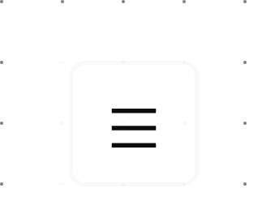

# Main Menu Commands

The main menu button is three horizontal lines in the upper left-hand corner of Argumentation:

To open it, click on it with your mouse or move your tab focus to it and then press enter. Once it's open, you can click on elements in it with your mouse or navigate to them with the Tab key.

Here are the functions in the Main Menu:

## New Map 

Starts a new map in place of the one you’re currently working on.

## Save

Saves any changes you’ve made to your map. You need to be logged in and subscribed to save a map. Saved maps are stored in your Argumentation account.

If you’re saving a map for the first time, “Save” will open a window that will let you choose a name for your map.

## Save as

Saves your map in your Argumentation account, so that you can load it later. “Save as” lets you name your map. You need to be logged in and subscribed to use the “Save as” function.

## Load

Lets you open maps you’ve saved in your Argumentation account. Clicking this button opens a window with a list of your saved maps. Clicking on one of these maps loads it. This window also lets you delete your saved maps.

## Logout
Logs you out of your account.

## Export as .png

Lets you export your map as a .png and download this to your computer. Clicking on this button will open a window that lets you choose a name for your file and a place on your computer to save it to.

## Export as .pdf

Lets you export your map as a .pdf and download this to your computer. Clicking on this button will open a window that lets you choose a name for your file and a place on your computer to save it to.

## Share Snapshot

Lets you share an image to your map, which will be created and stored online, with a link.

To share a snapshot of a map, you need to have saved it. Clicking “Share snapshot” opens a window that gives you the option to copy a link to an image of your saved map. When someone follows this link, they’ll be taken to an online image of your map.

## Share

To share a map, you need to have saved it. Clicking “Share” opens a window that gives you the option to copy a link to your saved map. When someone follows this link, they’ll be taken to your map on the Argumentation site.

## Manage Account

The "Manage Account" feature lets you manage your Argumentation.io subscription, update your Argumentation.io email address, or Reset your password. It also lets you know what kind of subscription you currently have, when you created your subscription, when your last invoice was sent (when you were last charged), and when your next invoice will be sent.

If you click "Manage Subscription" from the "Manage Account" window, you'll be prompted to enter your subscription email address to receive a link to the customer portal. Following this link will allow you to update your subscription, including canceling it. Please note that you may have used a different email to subscribe than you used to initially create your Argumentation.io account.

## Contact

Lets you send an email to Argumentation’s administrators. Use this function to ask us questions, report problems, or make suggestions.

## How To
Clicking "How To" takes you to this site (the one you're reading right now). It contains explanations of all of Argumentation.io's features.

## Textbook
If you're subscribed to Argumentation.io, you can download a textbook, in PDF format, called *With Good Reason: An Introduction to Critical Thinking and Argument Mapping*, from the Main Menu. You can find more information about *With Good Reason* [here](https://sites.google.com/view/jonathanreidsurovell/with-good-reason?authuser=0).

## Subscribe

Lets you choose a subscription plan for Argumentation. You need to be subscribed to save your maps.
