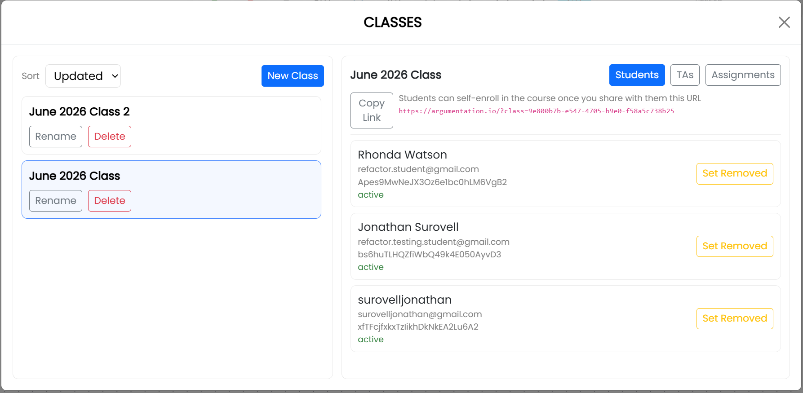

# Create and Manage Classes

## Create a class

1. Open **Main Menu** and select **Classes**.
2. Select **New Class**.
3. Enter a name for the class.
4. Select **OK**.

The class appears in the list on the left side of the **Classes** window. Select a class in that list to view its students, TAs, and assignments.

## Invite students

1. Select the class in the **Classes** window.
2. Select the **Students** tab.
3. Select **Copy Link**.
4. Send the class-enrollment link to the students.

Students enroll themselves by opening the link. See [Join a Class](./join-class.html) for the student procedure.

## Manage enrolled students

The **Students** tab displays each student's chosen name, account email, and status. Select **Set Removed** to remove a student's access to the class. A removed student can be made active again from the same list.

## Rename or delete a class

Use **Rename** beside a class to change its name. Use **Delete** to delete the class. Review the selected class carefully before deleting it.
