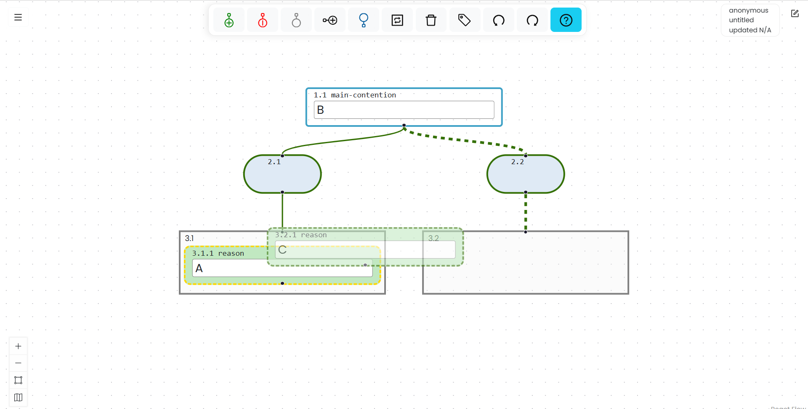
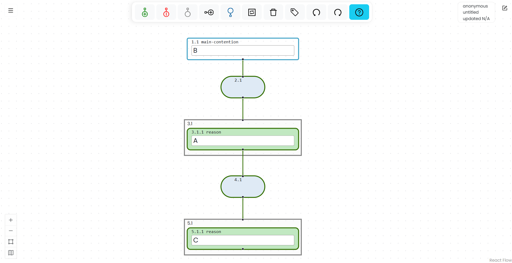

# Moving Boxes

In Argumentation.io, you can move reason and objection boxes to connect them to different reason, objection, main contention, or inference boxes. You cannot move main contention, inference, or group boxes.

When you drag a box over a valid destination, a yellow border appears around the destination.

## Move a reason or objection beneath another box

### With a mouse

Drag the reason or objection onto the desired box. When the yellow border appears around the destination, drop the box.

*The yellow border identifies the box that will receive the moved branch.*

*After the box is dropped, it and the boxes beneath it move to their new position in the argument.*

<iframe width="560" height="315" style="width:100%; max-width:560px; aspect-ratio:16/9;" src="https://www.youtube.com/embed/RunFG4CAx6E?si=Uz1zArdXhwkqwByX" title="Demonstration of moving a box with a mouse" frameborder="0" allow="accelerometer; autoplay; clipboard-write; encrypted-media; gyroscope; picture-in-picture; web-share" referrerpolicy="strict-origin-when-cross-origin" allowfullscreen></iframe>

### With a keyboard

1. Select the reason or objection you want to move.
2. Press `Shift+Alt+F` on Windows or `Shift+Option+F` on Mac to mark it as the move source.
3. Use the map-navigation commands to select the destination.
4. Press `Shift+Alt+E` on Windows or `Shift+Option+E` on Mac to complete the move.

The selected box's inference and group boxes, along with everything beneath it, move with it.

## Move a box into a co-premise group

To make a reason or objection a co-premise, either:

- Drag it over the top of the desired reason or objection group and drop it when the yellow border appears around the top of the group; or
- Select it, mark it as the move source, navigate to the desired group box, and use the execute-move command.

The keyboard commands are `Shift+Alt+F` followed by `Shift+Alt+E` on Windows, or `Shift+Option+F` followed by `Shift+Option+E` on Mac.

The following video demonstrates the mouse procedure:

<iframe width="560" height="315" style="width:100%; max-width:560px; aspect-ratio:16/9;" src="https://www.youtube.com/embed/Hgp_ILsDCAw?si=QzE6pkgFf5qsApw1" title="Demonstration of moving a box into a co-premise group" frameborder="0" allow="accelerometer; autoplay; clipboard-write; encrypted-media; gyroscope; picture-in-picture; web-share" referrerpolicy="strict-origin-when-cross-origin" allowfullscreen></iframe>

## Change the order of co-premises

### With a mouse

Drag the co-premise to the desired position. Move it just above the adjacent co-premise until the top of the group is highlighted in yellow, then drop it.

<iframe width="560" height="315" style="width:100%; max-width:560px; aspect-ratio:16/9;" src="https://www.youtube.com/embed/p-ykvwGcFJg?si=0hFu6kkGLlaTzJF6" title="Demonstration of changing the order of co-premises" frameborder="0" allow="accelerometer; autoplay; clipboard-write; encrypted-media; gyroscope; picture-in-picture; web-share" referrerpolicy="strict-origin-when-cross-origin" allowfullscreen></iframe>

### With a keyboard

To move a co-premise one position to the right, select it and press `Shift+Alt+N` on Windows or `Shift+Option+N` on Mac.

To move a co-premise one position to the left, select it and press `Shift+Alt+B` on Windows or `Shift+Option+B` on Mac.
