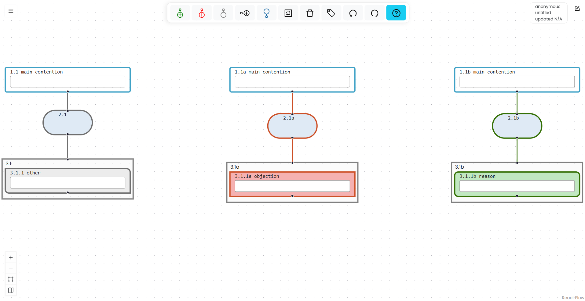

# Create Multiple Trees

A single Argumentation.io map can contain multiple argument trees on the same canvas. All the trees belong to the same saved map.

## Add a tree

Select **Add main contention** in the toolbar. The new main contention appears to the right of the current rightmost tree.

Trees cannot be manually reordered relative to one another.

## Navigate among trees

To cycle among the main contentions, press `Shift+Alt+M` on Windows or `Shift+Option+M` on Mac.

The ordinary map-navigation commands also move logically among boxes in different trees.

## Box numbering

Boxes in the first tree use the standard numbering. Boxes in the second tree have `a` appended to their numbers, boxes in the third tree have `b` appended, and later trees continue alphabetically.

## Delete a tree

Select the tree's main contention and use **Delete**. Deleting the main contention also deletes everything beneath it.

If other trees remain, Argumentation.io updates their numbering. For example, if the first tree is deleted, the tree previously identified with `a` becomes the first tree.

You cannot delete the main contention when it is the only main contention on the canvas.
