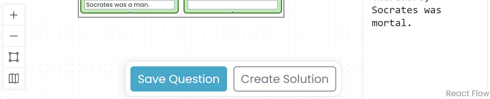

# Create Questions and Solutions

A question can include a starting map, a written prompt in the Scratchpad, or both. You can also prepare a solution that students may see according to the assignment's solution settings.

Questions and their solutions can be reused in multiple quizzes. This makes it easier to provide students with repeated argument-mapping practice and timely access to instructor-prepared solutions.

## Create a question

1. Prepare the map as you want it to appear to students.
2. Put the question prompt or source passage in the Scratchpad.
3. Open **Main Menu** and select **Save as Question**.
4. Enter a name for the question and select **OK**.

The question toolbar appears at the bottom of the workspace.

## Add a solution

1. Select **Add solution** in the question toolbar.
2. Add or revise map content and Scratchpad text to create the solution.
3. Select **Save solution**.

Argumentation.io confirms that the solution has been saved. Select **View Question** to return to the student-facing question.

## Manage saved questions

Open **Main Menu** and select **Questions**. The **Questions** window lists saved questions and indicates when a solution is linked. From this window, you can edit a question, edit its solution, rename it, or delete it.
