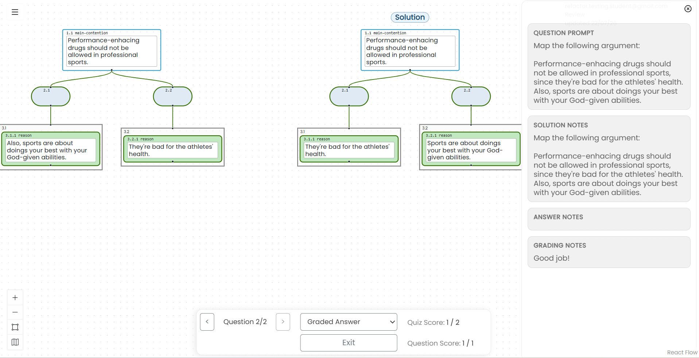

# Review an Assignment

Open **Main Menu** and select **My Assignments** to see available and submitted assignments. The list can show due dates, scores, attempts used or remaining, and commands for reviewing or retaking an assignment.

When review is available, select the review command for the relevant submission.

In review mode, you can move among questions and view the information released by the instructor. Depending on the assignment's settings and grading status, this may include:

- Your submitted answer
- The instructor-prepared solution
- Your score for the question and quiz
- The question prompt
- Solution notes
- Your answer notes
- Instructor feedback in **Grading Notes**

