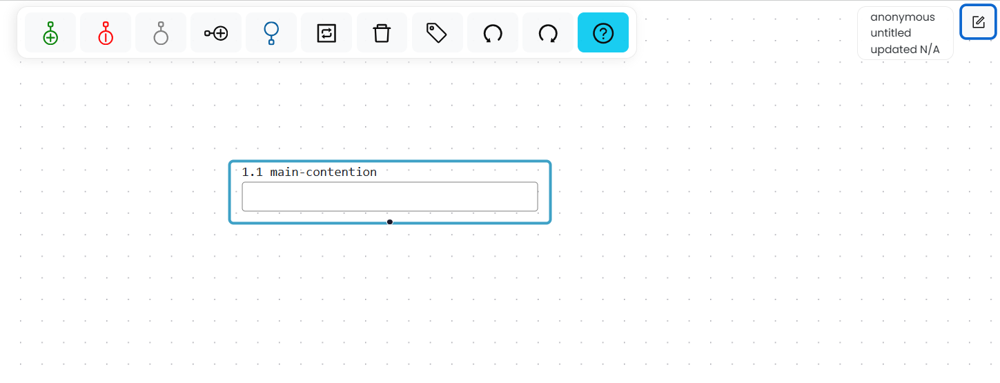
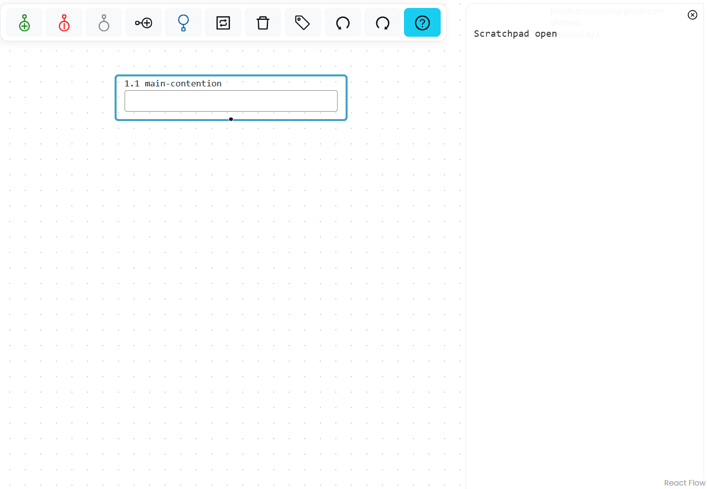

# Use the Scratchpad

The Scratchpad is a text-editing area alongside the map canvas. Use it for notes, source passages, instructions, or other text associated with a map.

To open or close the Scratchpad, select the Scratchpad control on the right side of the workspace. On Windows, you can instead press `Shift+Alt+S`; on Mac, press `Shift+Option+S`.

*Select the Scratchpad control at the upper right of the workspace.*

*The open Scratchpad appears alongside the map canvas.*

Text in the Scratchpad is saved and shared with the map. Questions and assignments also use the Scratchpad to display question prompts, student notes, solutions, and instructor feedback.
