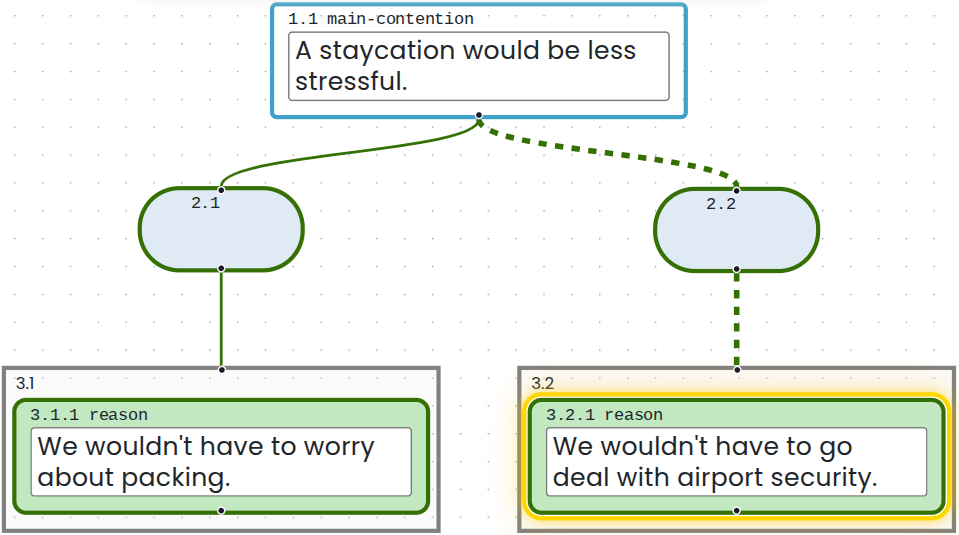
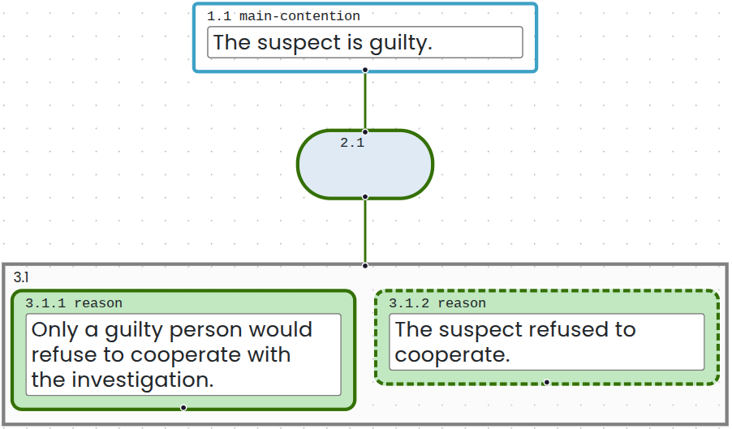

# Selecting Boxes and Navigating Your Map

You can select any box in an Argumentation.io map by selecting it with a mouse or touchscreen.

## Recognize the selected box

The selected box is surrounded by a yellow halo. The line connecting it to its parent also appears dashed while the box is selected.

These indicators show which box will be affected by editing commands. They disappear when you select another box.

## Navigate with a keyboard

On Windows, use `Shift+Alt` with the arrow keys. On Mac, use `Shift+Option` with the arrow keys:

- Up arrow: select the parent
- Down arrow: select the first child
- Right arrow: select the next sibling
- Left arrow: select the previous sibling

These commands follow the logical structure of the map. The `Tab` key moves among interactive interface elements and does not necessarily follow the map's logical structure.

To move among the main contentions of a map containing multiple trees, press `Shift+Alt+M` on Windows or `Shift+Option+M` on Mac.

## Mark a premise as suppressed

A suppressed premise is an unstated premise that is needed to support an inference. You can mark a premise as suppressed by giving its box a dashed outline.

1. Select the premise you want to mark.
2. Select **Mark as suppressed premise** in the toolbar. On Windows, you can instead press `Shift+Alt+U`; on Mac, press `Shift+Option+U`.

To restore the box's solid outline, use the button or keyboard command again.

A dashed box outline indicates a suppressed premise. By contrast, the yellow halo and the temporarily dashed line connecting a box to its parent indicate that the box is selected.

