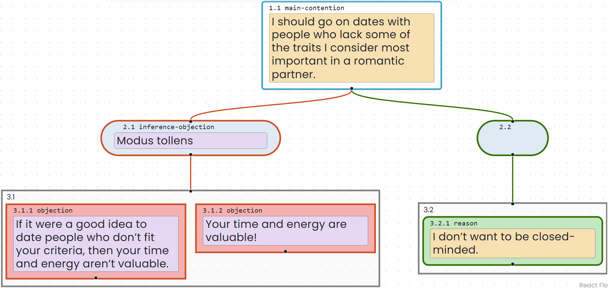
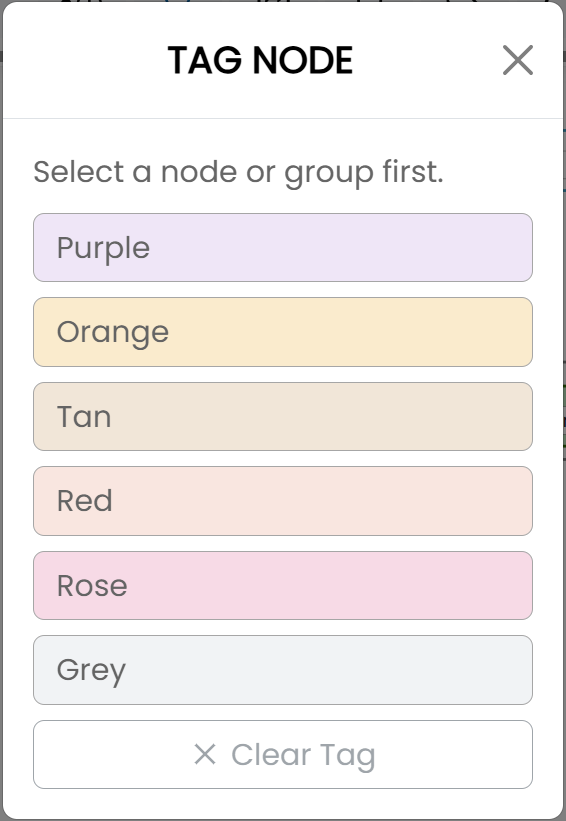

# Apply Color Tags

Color tags can distinguish speakers, positions, sides of a debate, or other categories chosen by the map's author. A tag changes the background color of a box's text area without changing the box's logical type.

Available tags are purple, orange, tan, red, rose, and grey.

## Apply a tag

1. Select a box or group.
2. Select **Tag** in the toolbar. On Windows, you can instead press `Shift+Alt+T`; on Mac, press `Shift+Option+T`.
3. Select a color from the **Tag Node** window.

The selected box or group is tagged with that color.

## Use the Tag menu with a keyboard

1. Select a box or group.
2. Open the Tag menu with `Shift+Alt+T` on Windows or `Shift+Option+T` on Mac.
3. Press `Tab` to move to the first color.
4. Use the Up and Down arrow keys to move among the colors.
5. Press `Enter` to apply the selected color.

## Remove a tag

1. Select the tagged box or group.
2. Open the Tag menu.
3. Select **Clear Tag**.

The text area returns to its default white background.

Tags are retained when maps are saved or shared and appear in exported maps. Screen readers announce the tag color of a selected box.
