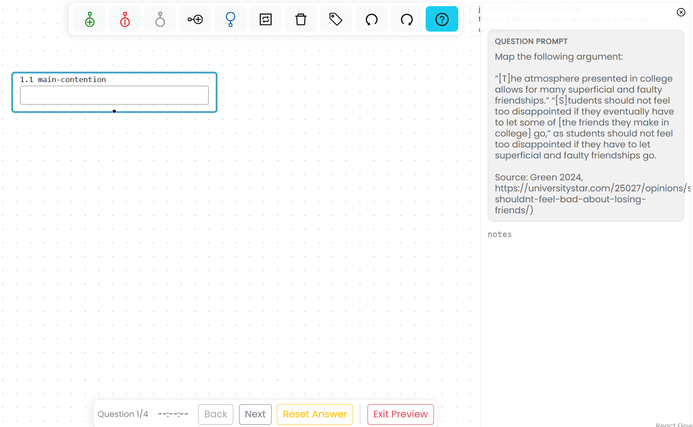

# Take an Assignment

You can open an available assignment from the link supplied by your instructor or from **My Assignments** in **Main Menu**.

## Answer questions

The question prompt appears in the Scratchpad. Your answer may consist of work on the canvas, text in the Scratchpad, or both. For example, a question may ask you to construct or complete an argument map on the canvas and use the Scratchpad for accompanying notes.

The assignment toolbar at the bottom of the workspace shows which question you are answering and, for timed work, the time remaining. Its controls allow you to:

- Return to the previous question
- Submit the current answer
- Reset the current answer
- Submit the complete assignment

Review your work before submitting the complete assignment. After submission, the available review or retake options depend on the settings selected by your instructor.

## Start another attempt

If multiple attempts are allowed, **My Assignments** shows the attempts available. When you begin another attempt, Argumentation.io identifies the earlier submission and gives you the option to start the next attempt or review the previous one.
