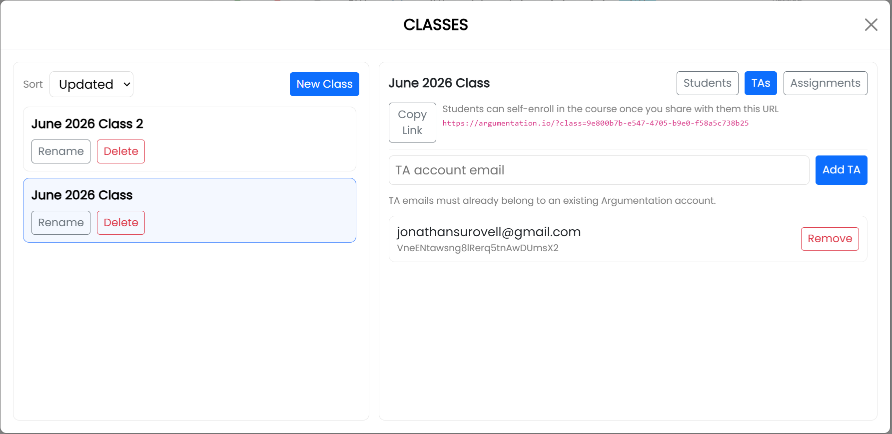

# Work with Teaching Assistants

Add a teaching assistant (TA) to a particular class from the **Classes** window. The TA must already have an Argumentation.io account.

## Add a TA

1. Open **Main Menu** and select **Classes**.
2. Select the relevant class.
3. Select the **TAs** tab.
4. Enter the email address associated with the TA's Argumentation.io account.
5. Select **Add TA**.

The TA's account appears in the class's TA list.

## Remove a TA

Open the **TAs** tab for the class and select **Remove** beside the TA's account.
