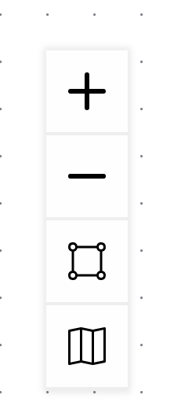

# Use the View Panel

The View Panel is a vertical group of four controls in the lower-left corner of the Argumentation.io workspace. Select the controls with a mouse, or use `Tab` and `Shift+Tab` to move keyboard focus to and through them.

## Zoom in

Select the first control, marked with a plus sign, to make the map appear larger.

## Zoom out

Select the second control, marked with a minus sign, to make the map appear smaller.

## Fit the map to the available space

Select the third control to adjust the map's scale and position so that the complete map fits within the available canvas area.

## Show or hide the mini-map

Select the fourth control to show a miniature overview of the map in the lower-right corner of the workspace. Select the control again to hide the mini-map.

The mini-map is particularly useful when the complete argument extends beyond the visible canvas.
