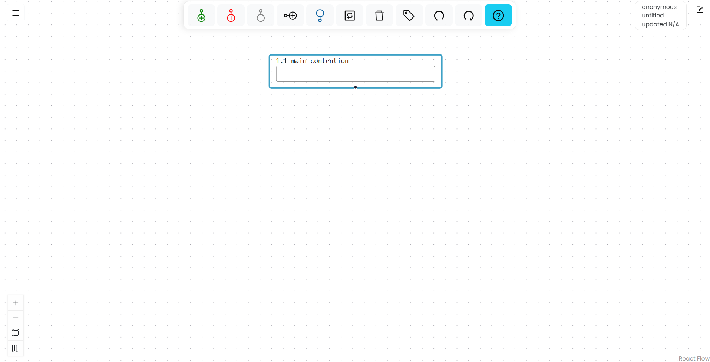
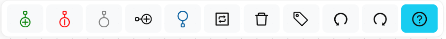

# Explore the Argumentation.io Workspace

The Argumentation.io workspace contains a canvas for your argument map and several groups of controls.

## Canvas

The canvas is the main area of the workspace. It contains the boxes and connecting lines that make up your argument map. You can move your view by dragging an empty area of the canvas.

## Toolbar

The toolbar is centered at the top of the workspace. Its controls, from left to right, are:

1. **Add reason**
2. **Add objection**
3. **Add other**
4. **Add co-premise**
5. **Add main contention**
6. **Toggle reason/objection/other**
7. **Delete**
8. **Tag**
9. **Undo**
10. **Redo**
11. **Key commands**

The available action may depend on which box is selected. For example, select a box before adding a reason beneath it or applying a tag.

## Main Menu

The **Main Menu** button is in the upper-left corner. It contains commands for starting, saving, loading, sharing, and exporting maps; managing your account; and opening this documentation.

Additional commands appear for students and for users with instructor features enabled. See [Main Menu](./main_menu.html).

## Information panel

The information panel is in the upper-right corner. Depending on the map and your account, it can display your account email, the map name, the host of a collaborative map, and the map's save status.

## Scratchpad

The Scratchpad provides space for notes or source text alongside a map. See [Use the Scratchpad](./scratchpad.html).

## View Panel

The View Panel is in the lower-left corner. Use it to zoom in, zoom out, fit the map to the available space, or show the mini-map. See [Use the View Panel](./view_panel.html).
